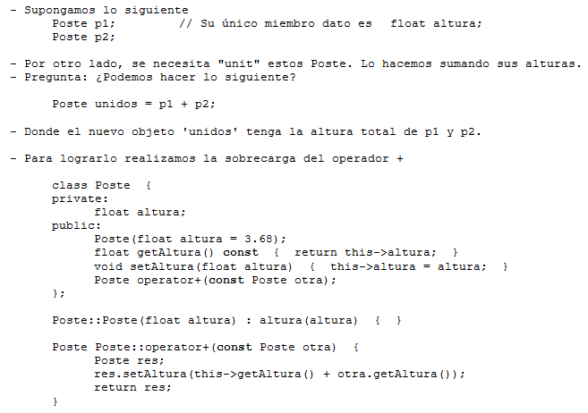

.. -*- coding: utf-8 -*-

.. _rcs_subversion:

Clase 02 - PGE 2018
===================
(Fecha: 16 de agosto)

Herencia
========

.. code-block::

    template <class T> class Lista : public Listado<T>  {
 
        //////////

    };

- Es posible también que una clase derive de una u otra según se requiera.

.. code-block::

	#include <QString>
	#include <QDebug>
	#include <typeinfo>

	class Real {
	private:
    	    int colores;

	public:
    	    Real(int colores) : colores(colores)  {  }
     	    int getDato()  {  return colores;  }
	};

	class Virtual {
	private:
    	    int bits;

	public:
    	    Virtual(int bits) : bits(bits)  {  }
    	    int getDato()  {  return bits;  }
	};

	template <class T> class Mundo : public T  {
	private:
    	    QString nombre;

	public:
    	    Mundo(QString nombre, int dato) : T(dato), nombre(nombre)  {  }

    	    QString toString()  {
        	QString descripcion = "El mundo " + nombre + " es de ";
        	descripcion.append(QString::number(T::getDato()));

        	if (typeid(T) == typeid(Real))
            	    descripcion.append(" colores.");
        	if (typeid(T) == typeid(Virtual))
            	    descripcion.append(" bits.");

        	return descripcion;
    	    }
    	};

	int main(int, char **)  {
    	    Mundo<Real> mundo1("Tierra", 10000);
    	    Mundo<Virtual>* mundo2 = new Mundo<Virtual>("StarCraft", 64);

    	    qDebug() << mundo1.toString();
    	    qDebug() << mundo2->toString();

	    return 0;
	}

**Ejercicio**

- Agregar la características a Mundo para que pueda heredar de cualquier clase, no sólo de Real y Virtual
- Que compile y deje ejecutar la aplicación pero el toString publicar que el Mundo creado no es posible.

Sobrecarga de operadores 
========================

Ejercicio 2:
============

- Modificar la clase genérica Listado sobrecargando operator+ de tal forma que al sumar dos listados se obtenga un nuevo objeto Listado con los elementos consecutivos.

.. code-block::

	template <class T> class Listado  {
	public:
		Listado(int n=10);
		bool add(T nuevo);
		T get(int i) const;
		int length() const;
		Listado<T> operator+(const Listado<T> otro);

	private:
		int cantidad;
		int libre;
		T *v;
	};

	template <class T> Listado<T>::Listado(int n) : cantidad(n), libre(0), v(new T[n])  {  

	}

	template <class T> bool Listado<T>::add(T nuevo)  {
		if (libre < cantidad)  {
			v[libre] = nuevo;
			libre++;
			return true;
		}
		return false;
	}

	template <class T> T Listado<T>::get(int i) const  {  return v[i];  }

	template <class T> int Listado<T>::length() const  {  return libre;  }

	template <class T> Listado<T> Listado<T>::operator+(const Listado<T> otro)  {
		T vAux[this->length() + otro.length()];

		int contador = 0;

		for ( ; contador<this->length() ; contador++)
			vAux[contador] = this->get(contador);

		for (int i=0 ; contador < (this->length() + otro.length()) ; contador++, i++)
			vAux[contador] = otro.get(i);

		Listado<T> res(this->length() + otro.length());

		for (int j=0 ; j < contador ; j++)
			res.add(vAux[j]);

		return res;
	}

Ejercicio 3:
============

- Sobrecargar el operador ++ para que duplique la cantidad máxima de elementos y también duplique los valores que ya existían.

