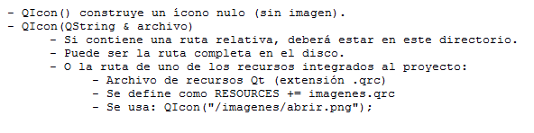

.. -*- coding: utf-8 -*-

.. _rcs_subversion:

Clase 10 - PGE 2018
===================
(Fecha: 17 de septiembre)

**QMainWindow**

.. figure:: images/clase08/qmainwindow.png

**QAction**

.. figure:: images/clase08/qaction.png

**QIcon**

:Buscar íconos aquí: http://findicons.com/

Ejercicio 13:
============

- Editor de  código fuente C++

.. figure:: images/clase08/ejercicio.png

