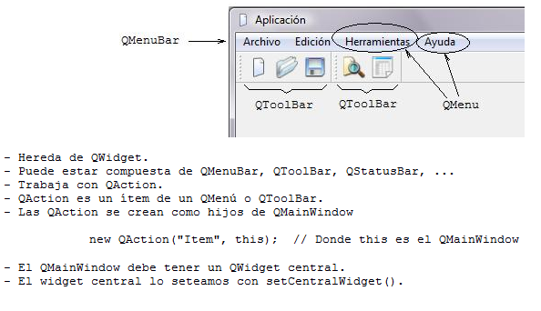

.. -*- coding: utf-8 -*-

.. _rcs_subversion:

Clase 10 - PGE 2019
===================
(Fecha: 24 de septiembre)

**Creación y uso de librerías dinámicas**

.. figure:: images/clase08/librerias.png

.. figure:: images/clase08/librerias01.png

.. figure:: images/clase08/librerias02.png

.. figure:: images/clase08/librerias03.png

Ejercicio 12
============

- Utilizar la clase LineaDeTexto.
- Con todas las carecterísticas que hemos ido agregando (las sugerencias, los operadores, etc.)
- Crear una librería dinámica con esta clase.
- Usar esta librería en otro proyecto para probar su funcionamiento.

Uso de una clase propia con QtDesigner
======================================

- Deben heredar de algún QWidget
- Colocamos el widget (clase base) con QtDesigner
- Clic derecho "Promote to"

.. figure:: images/clase07/qtdesigner.png
					 
- Base class name: QLabel
- Promoted class name: MiLabel
- Header file: miLabel.h
- Add (y con esto queda disponible para promover)

- La clase MiLabel deberá heredar de QLabel
- El constructor debe tener como parámetro:

.. code-block::

	MiLabel( QWidget * parent = 0 );  // Esto en miLabel.h

	MiLabel::MiLabel( QWidget * parent ) : QLabel( parent )  {  // Esto en miLabel.cpp
	
	}

**QMainWindow**

**QAction**

.. figure:: images/clase08/qaction.png

**QIcon**

.. figure:: images/clase08/qicon.png

:Buscar íconos aquí: http://findicons.com/

Ejercicio 13:
============

- Editor de  código fuente C++

.. figure:: images/clase08/ejercicio.png

