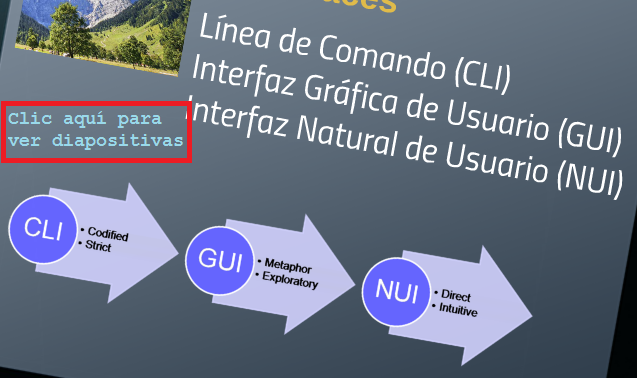

.. -*- coding: utf-8 -*-

.. _rcs_subversion:

Clase 11 - PGE 2018
===================
(Fecha: 20 de septiembre)

CLI >> GUI >> NUI
=================

Ejercicio 14:
============

- Proponer una interfaz gráfica de usuario
- Que sea sólo de una ventana
- Buscar algún sitio, en algún video, alguna aplicación para móvil o desktop
- Replicarla en Qt
- Diseñar tus propias clases Boton y BotonDeslizante
- Usar promoción con QtDesigner
- Acomodar los widgets a mano (sin usar QGridLayout)

