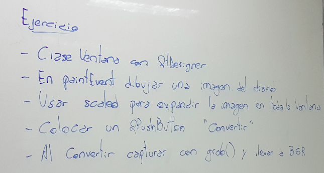
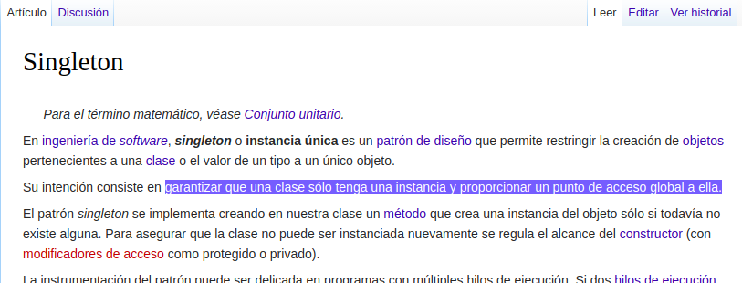

.. -*- coding: utf-8 -*-

.. _rcs_subversion:

Clase 14 - PGE 2019
===================
(Fecha: 15 de octubre)

MiniExamen de preguntas múltiples
=================================

:Tarea para Clase 17:
	Completar y estudiar exhaustivamente operador de asignación y constructor copia

	Estudiar eventFilter y LineaDeTexto mejorado

	Ver `Tutorial Qt Creator - qDebug Operador de inserción <https://www.youtube.com/watch?v=IBMU3FyisKY>`_ de `Videos tutoriales de Qt <https://www.youtube.com/playlist?list=PL54fdmMKYUJvn4dAvziRopztp47tBRNum>`_

	Ver `Tutorial Qt Creator - Timer <https://www.youtube.com/watch?v=_Ps7aHDoAr4>`_ de `Videos tutoriales de Qt <https://www.youtube.com/playlist?list=PL54fdmMKYUJvn4dAvziRopztp47tBRNum>`_

	Ver `Tutorial Qt Creator - QTimer <https://www.youtube.com/watch?v=c6JZECBL54Q>`_ de `Videos tutoriales de Qt <https://www.youtube.com/playlist?list=PL54fdmMKYUJvn4dAvziRopztp47tBRNum>`_

	Ver `Tutorial Qt Creator - Archivo de recursos <https://www.youtube.com/watch?v=u8xKE0zHLsE>`_ de `Videos tutoriales de Qt <https://www.youtube.com/playlist?list=PL54fdmMKYUJvn4dAvziRopztp47tBRNum>`_

	Se tomarán preguntas en Opcionables y un MiniExamen para desarrollar en computadora

Ejercicio 17:
============

- Agregar un QPushButton "Capturar imagen" para procesarla
- Dibujar con paintEvent esa imagen procesada 
- Procesar la imagen con lo siguiente:
	- Invertir los colores rgb a bgr
	- Transformar a escala de grises
		Y = 0.3 R + 0.3 G + 0.3 B // Y en cada componente
	- Convertir al negativo: Cada componente, si lo leemos en binario, debemos invertir cada bit.
		- Ejemplo: R=144=10010000 -> R=01101111

Levantar frame por frame: Clase QAbstractVideoSurface
=====================================================

- QAbstractVideoSurface es una clase abstracta
- Proporciona streaming de video a través de la función virtual pura present()

.. code-block:: c++

	bool QAbstractVideoSurface::present ( const QVideoFrame & frame ) [pure virtual]

**Clase Capturador para obtener los frames de la cámara**

.. code-block:: c++

	class Capturador : public QAbstractVideoSurface  {
	    Q_OBJECT

	public:
	    Capturador( QObject * parent = 0 );

	    QList< QVideoFrame::PixelFormat > supportedPixelFormats(
	          QAbstractVideoBuffer::HandleType handleType = QAbstractVideoBuffer::NoHandle ) const;

	    bool present( const QVideoFrame & frame );

	    QVideoFrame getFrameActual()  {  return frameActual;  }

	private:
	    QVideoFrame frameActual;
	};

- QVideoFrame encapsula los datos de video (bits, ancho, alto, etc.)
- Para acceder a los bits es necesario mapearlo con el método map()
- El mapeo deja en memoria los datos para se accedidos.

.. code-block:: c++

	bool Capturador::present( const QVideoFrame & frame )  {
	    frameActual = frame;
		
	    frameActual.map( QAbstractVideoBuffer::ReadOnly );
		
	    return true;  // Con la idea de devolver true si este frame fue usado
	}

- La función virtual pura supportedPixelFormats() devuelve un listado de formatos soportados.

.. code-block:: c++

	QList< QVideoFrame::PixelFormat > Capturador::supportedPixelFormats(
	                         QAbstractVideoBuffer::HandleType handleType ) const  {
	
	    if ( handleType == QAbstractVideoBuffer::NoHandle ) {
	        return QList< QVideoFrame::PixelFormat >()
	                                                  << QVideoFrame::Format_RGB32
	                                                  << QVideoFrame::Format_ARGB32;
	    }
	    else {
	        return QList< QVideoFrame::PixelFormat >();
	    }
	}

**El constructor**

.. code-block:: c++

	Capturador::Capturador( QObject * parent ) : QAbstractVideoSurface( parent )  {

	}

Ejercicio 18:
============

- Usar Capturador para levantar las imágenes de la cámara.
- Convertir a escala de grises y visualizarlo en pantalla.

Ejercicio 19:
============

Ejercicio 20:
============

.. figure:: images/clase11/ejer3.png

- En esa grilla de 6 celdas, todas esas celdas son objetos Frame.
- 5 de ellos serán imágenes fijas cargadas desde el disco duro.
- La restante serán las imágenes obtenidas en tiempo real desde la cámara.

Ejercicio 21:
============

.. figure:: images/clase11/ejer4.png

Uso de singleton
================

