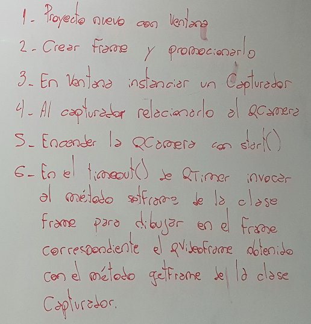

.. -*- coding: utf-8 -*-

.. _rcs_subversion:

Clase 14 - PGE 2019
===================
(Fecha: 15 de octubre)

MiniExamen de preguntas múltiples
=================================

:Tarea para Clase 16:
	Completar y estudiar exhaustivamente operador de asignación y constructor copia

	Estudiar eventFilter y LineaDeTexto mejorado

	Ver `Tutorial Qt Creator - qDebug Operador de inserción <https://www.youtube.com/watch?v=IBMU3FyisKY>`_ de `Videos tutoriales de Qt <https://www.youtube.com/playlist?list=PL54fdmMKYUJvn4dAvziRopztp47tBRNum>`_

	Ver `Tutorial Qt Creator - Timer <https://www.youtube.com/watch?v=_Ps7aHDoAr4>`_ de `Videos tutoriales de Qt <https://www.youtube.com/playlist?list=PL54fdmMKYUJvn4dAvziRopztp47tBRNum>`_

	Ver `Tutorial Qt Creator - QTimer <https://www.youtube.com/watch?v=c6JZECBL54Q>`_ de `Videos tutoriales de Qt <https://www.youtube.com/playlist?list=PL54fdmMKYUJvn4dAvziRopztp47tBRNum>`_

	Ver `Tutorial Qt Creator - Archivo de recursos <https://www.youtube.com/watch?v=u8xKE0zHLsE>`_ de `Videos tutoriales de Qt <https://www.youtube.com/playlist?list=PL54fdmMKYUJvn4dAvziRopztp47tBRNum>`_

	Se tomarán preguntas en Opcionables y un MiniExamen para desarrollar en computadora

Ejercicio 17:
============

- Agregar un QPushButton "Capturar imagen" para procesarla
- Dibujar con paintEvent esa imagen procesada 
- Procesar la imagen con lo siguiente:
	- Invertir los colores rgb a bgr
	- Transformar a escala de grises
		Y = 0.3 R + 0.3 G + 0.3 B // Y en cada componente
	- Convertir al negativo: Cada componente, si lo leemos en binario, debemos invertir cada bit.
		- Ejemplo: R=144=10010000 -> R=01101111

Levantar frame por frame: Clase QAbstractVideoSurface
=====================================================

- QAbstractVideoSurface es una clase abstracta
- Proporciona streaming de video a través de la función virtual pura present()

.. code-block:: c++

	bool QAbstractVideoSurface::present ( const QVideoFrame & frame ) [pure virtual]

**Clase Capturador para obtener los frames de la cámara**

.. code-block:: c++

	class Capturador : public QAbstractVideoSurface  {
	    Q_OBJECT

	public:
	    Capturador( QObject * parent = 0 );

	    QList< QVideoFrame::PixelFormat > supportedPixelFormats(
	          QAbstractVideoBuffer::HandleType handleType = QAbstractVideoBuffer::NoHandle ) const;

	    bool present( const QVideoFrame & frame );

	    QVideoFrame getFrameActual()  {  return frameActual;  }

	private:
	    QVideoFrame frameActual;
	};

- QVideoFrame encapsula los datos de video (bits, ancho, alto, etc.)
- Para acceder a los bits es necesario mapearlo con el método map()
- El mapeo deja en memoria los datos para se accedidos.

.. code-block:: c++

	bool Capturador::present( const QVideoFrame & frame )  {
	    frameActual = frame;
		
	    frameActual.map( QAbstractVideoBuffer::ReadOnly );
		
	    return true;  // Con la idea de devolver true si este frame fue usado
	}

- La función virtual pura supportedPixelFormats() devuelve un listado de formatos soportados.

.. code-block:: c++

	QList< QVideoFrame::PixelFormat > Capturador::supportedPixelFormats(
	                         QAbstractVideoBuffer::HandleType handleType ) const  {
	
	    if ( handleType == QAbstractVideoBuffer::NoHandle ) {
	        return QList< QVideoFrame::PixelFormat >()
	                                                  << QVideoFrame::Format_RGB32
	                                                  << QVideoFrame::Format_ARGB32;
	    }
	    else {
	        return QList< QVideoFrame::PixelFormat >();
	    }
	}

**El constructor**

.. code-block:: c++

	Capturador::Capturador( QObject * parent ) : QAbstractVideoSurface( parent )  {

	}

Ejercicio 18:
============

- Usar Capturador para levantar las imágenes de la cámara.
- Convertir a escala de grises y visualizarlo en pantalla.

Ejercicio 19:
============

.. figure:: images/clase11/ejer2.png

Ejercicio 20:
============

.. figure:: images/clase11/ejer3.png

- En esa grilla de 6 celdas, todas esas celdas son objetos Frame.
- 5 de ellos serán imágenes fijas cargadas desde el disco duro.
- La restante serán las imágenes obtenidas en tiempo real desde la cámara.

Ejercicio 21:
============

Ejemplo del Login independiente
===============================

.. code-block:: c++

	#include <QApplication>
	#include "manager.h"

	int main( int argc, char ** argv )
	{
	    QApplication a( argc, argv );

	    Manager manager;
	    manager.iniciar();

	    return a.exec();
	}

.. code-block:: c++

	#ifndef MANAGER_H
	#define MANAGER_H

	#include <QObject>
	#include <QVector>

	#include "login.h"
	#include "formulario.h"

	class Manager : public QObject
	{
	    Q_OBJECT
	public:
	    explicit Manager( QObject * parent = 0 );

	    void iniciar();

	private:
	    Login * login;
	    Formulario * formulario;

	private slots:
	    void slot_ingreso( bool valido, QStringList usuario );

	};

	#endif // MANAGER_H

.. code-block:: c++

	#include "manager.h"

	Manager::Manager( QObject * parent ) : QObject( parent ),
	                                       login( new Login ),
	                                       formulario( new Formulario )
	{

	    connect( login, SIGNAL( signal_usuarioValidado( bool, QStringList ) ), 
	             this, SLOT( slot_ingreso( bool, QStringList ) ) );

	    QVector< QStringList > nuevosUsuarios;

	    QStringList usuario1;  usuario1 << "carlos" << "123";
	    QStringList usuario2;  usuario2 << "miguel" << "1234";
	    QStringList usuario3;  usuario3 << "julio" << "12345";

	    nuevosUsuarios << usuario1 << usuario2 << usuario3;

	    login->setBaseUsuarios( nuevosUsuarios );
	}

	void Manager::iniciar()
	{
	    login->show();
	}

	void Manager::slot_ingreso( bool valido, QStringList usuario )
	{
	    if ( valido )  {
	        login->hide();
	        formulario->show();
	        formulario->setWindowTitle( "Bienvenido: " + usuario.at( 0 ) );
	    }
	    else  {
	        login->close();
	    }
	}

.. code-block:: c++

	#ifndef LOGIN_H
	#define LOGIN_H

	#include <QWidget>
	#include <QVector>
	#include <QStringList>

	namespace Ui {
	    class Login;
	}

	class Login : public QWidget
	{
	    Q_OBJECT

	public:
	    explicit Login( QWidget * parent = 0 );
	    ~Login();

	    /**
	     * @brief setBaseUsuarios Permite agregar usuarios permitidos para 
	              este login. Siempre estara el usuario admin:nimda
	     * @param usuarios Son los nuevos usuarios que se agregan a 
	              este login sin borrar los anteriores.
	     */
	    void setBaseUsuarios( QVector< QStringList > usuarios );

	private:
	    Ui::Login *ui;

	    /**
	     * @brief usuarios Se mantienen todos los usuarios validos para este login. 
	              El QStringList almacena las credenciales usuario:clave
	     */
	    QVector< QStringList > usuarios;

	private slots:
	    void slot_validarUsuario();

	signals:

	    /**
	     * @brief signal_usuarioValidado Se emite cuando un usuario intenta ingresar.
	     * @param valido Si es true entonces el usuario es valido, sino devuelve false.
	     * @param usuario Son las credenciales que el usuario ingresa.
	     */
	    void signal_usuarioValidado( bool valido, QStringList usuario );
	};

	#endif // LOGIN_H

.. code-block:: c++

	#include "login.h"
	#include "ui_login.h"

	Login::Login( QWidget * parent ) : QWidget( parent ),
	                                   ui( new Ui::Login )
	{
	    ui->setupUi( this );

	    QStringList usuarioAdmin;
	    usuarioAdmin << "admin" << "nimda";

	    usuarios << usuarioAdmin;

	    connect( ui->pbIngresar, SIGNAL( pressed() ), this, SLOT( slot_validarUsuario() ) );
	    connect( ui->leClave, SIGNAL( returnPressed() ), this, SLOT( slot_validarUsuario() ) );
	}

	Login::~Login()
	{
	    delete ui;
	}

	void Login::setBaseUsuarios( QVector< QStringList > usuarios )
	{
	    this->usuarios << usuarios;
	}

	void Login::slot_validarUsuario()
	{
	    QStringList usuarioIngresado;
	    usuarioIngresado << ui->leUsuario->text() << ui->leClave->text();

	    if ( this->usuarios.contains( usuarioIngresado ) )
	        emit signal_usuarioValidado( true, usuarioIngresado );
	    else
	        emit signal_usuarioValidado( false, usuarioIngresado );
	}

.. code-block:: c++

	#ifndef FORMULARIO_H
	#define FORMULARIO_H

	#include <QWidget>

	namespace Ui {
	    class Formulario;
	}

	class Formulario : public QWidget
	{
	    Q_OBJECT

	public:
	    explicit Formulario( QWidget * parent = 0 );
	    ~Formulario();

	private:
	    Ui::Formulario *ui;
	};

	#endif // FORMULARIO_H

.. code-block:: c++

	#include "formulario.h"
	#include "ui_formulario.h"

	Formulario::Formulario( QWidget * parent ) : QWidget( parent ),
	                                             ui( new Ui::Formulario )
	{
	    ui->setupUi( this );
	}

	Formulario::~Formulario()
	{
	    delete ui;
	}

Ejercicio 22:
============

- Modificar el ejemplo anterior para disponer de las siguientes clases: Manager, Login, Principal y Ventana (tal como lo vimos en clase).
- Agregar en Login el siguiente método para poder utilizar una base SQLite.

.. code-block:: c++

	bool validarCon( QString archvioSqlite, QString tabla, QString campoUsuario, QString campoClave );

- Dar a este método la funcionalidad que desee, pero es obligatorio que se escriba la documentación en el mismo código.

Uso de singleton
================

.. figure:: images/clase13/singleton.png

**Ejemplo de Manager como singleton**

.. code-block:: c++

	#include <QApplication>
	#include "manager.h"

	int main( int argc, char ** argv )
	{
	    QApplication a( argc, argv );

	    Manager::getInstancia()->iniciar();

	    return a.exec();
	}

.. code-block:: c++

	#ifndef MANAGER_H
	#define MANAGER_H

	#include <QObject>
	#include <QVector>

	#include "login.h"
	#include "formulario.h"

	class Manager : public QObject
	{
	    Q_OBJECT

	private:
	    static Manager *instancia;
	    explicit Manager( QObject * parent = 0 );

	public:
	    static Manager *getInstancia();
	    ~Manager();

	    void iniciar();

	private:
	    Login * login;
	    Formulario * formulario;

	private slots:
	    void slot_ingreso( bool valido, QStringList usuario );

	};

	#endif // MANAGER_H

.. code-block:: c++

	#include "manager.h"

	Manager * Manager::instancia = NULL;

	Manager::Manager( QObject * parent ) : QObject( parent ),
	                                       login( new Login ),
	                                       formulario( new Formulario )
	{

	    connect( login, SIGNAL( signal_usuarioValidado( bool, QStringList ) ), 
	             this, SLOT( slot_ingreso( bool, QStringList ) ) );

	    QVector< QStringList > nuevosUsuarios;

	    QStringList usuario1;  usuario1 << "carlos" << "123";
	    QStringList usuario2;  usuario2 << "miguel" << "1234";
	    QStringList usuario3;  usuario3 << "julio" << "12345";

	    nuevosUsuarios << usuario1 << usuario2 << usuario3;

	    login->setBaseUsuarios( nuevosUsuarios );
	}

	Manager * Manager::getInstancia()
	{
	    if( instancia == NULL )
	    {
	        instancia = new Manager();
	    }
	    return instancia;
	}

	Manager::~Manager()
	{
	    if( instancia != NULL )
	    {
	        delete instancia;
	    }
	}

	void Manager::iniciar()
	{
	    login->show();
	}

	void Manager::slot_ingreso( bool valido, QStringList usuario )
	{
	    if ( valido )  {
	        login->hide();
	        formulario->show();
	        formulario->setWindowTitle( "Bienvenido: " + usuario.at( 0 ) );
	    }
	    else  {
	        login->close();
	    }  
	}

Ejercicio 23:
============

- Hacer funcionar este ejemplo con Formulario, Login y Manager como singleton.
- Agregar la característica a Formulario para que se puedan agregar nuevos usuarios a login.
- Al cerrar Formulario, no se cierra el programa sino que vuelve a Login para que pueda usar el usuario nuevo.
- Cuando un usuario se loguea, Login se debe ocultar.

Uso de atributos estáticos
^^^^^^^^^^^^^^^^^^^^^^^^^^

.. code-block:: c++

	// Archivo archivador.h
	#ifndef ARCHIVADOR_H
	#define ARCHIVADOR_H

	#include <QFile>
	#include <QTextStream>

	class Archivador  {
	private:
	    static QFile *file;

	public:
	    static bool abrir( QString ruta );
	    static bool almacenar( QString texto );
	};
	
	#endif // ARCHIVADOR_H

	
.. code-block:: c++

	// Archivo archivador.cpp
	#include "archivador.h"

	QFile * Archivador::file = new QFile("./defecto.txt");

	bool Archivador::abrir( QString ruta )  {
	    file->setFileName( ruta );

	    if ( ! file->exists() )  {
	        return false;
	    }

	    return file->open( QIODevice::Append | QIODevice::Text );
	}

	bool Archivador::almacenar( QString texto )  {
	    if ( ! file->isOpen() )
	        return false;

	    QTextStream salida( file );
	    salida << texto;

	    return true;
	}

Ejercicio 24:
============

.. figure:: images/clase13/logger.png

