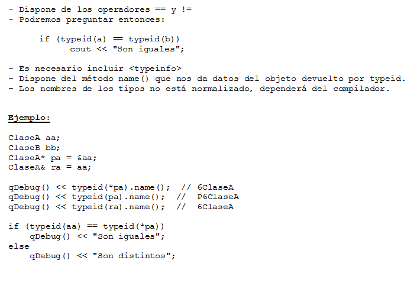

.. -*- coding: utf-8 -*-

.. _rcs_subversion:

Clase 16 - PGE 2018
===================
(Fecha: 8 de octubre)

Recordatorio sobre la entrega de ejercicios
===========================================

- Se deberán entregar todos aquellos ejercicios que están enumerados
- Cada alumno entregará sólo algunos ejercicios ordenados según este `Documento en Drive <https://docs.google.com/spreadsheets/d/1zVNfyvZA01IA9ErGCsfEZLRegmMzTmTWH6xRbXhRpP0/edit?usp=sharing>`_

Uso de atributos estáticos
^^^^^^^^^^^^^^^^^^^^^^^^^^

.. code-block:: c++

	// Archivo archivador.h
	#ifndef ARCHIVADOR_H
	#define ARCHIVADOR_H

	#include <QFile>
	#include <QTextStream>

	class Archivador  {
	private:
	    static QFile *file;

	public:
	    static bool abrir( QString ruta );
	    static bool almacenar( QString texto );
	};
	
	#endif // ARCHIVADOR_H

	
.. code-block:: c++

	// Archivo archivador.cpp
	#include "archivador.h"

	QFile * Archivador::file = new QFile("./defecto.txt");

	bool Archivador::abrir( QString ruta )  {
	    file->setFileName( ruta );

	    if ( ! file->exists() )  {
	        return false;
	    }

	    return file->open( QIODevice::Append | QIODevice::Text );
	}

	bool Archivador::almacenar( QString texto )  {
	    if ( ! file->isOpen() )
	        return false;

	    QTextStream salida( file );
	    salida << texto;

	    return true;
	}

Ejercicio 24:
============

.. figure:: images/clase13/logger.png

typeid
======

.. figure:: images/clase09/typeid.png

**Clase type_info**

- Dispone de un método para preguntar si es puntero y otro método para saber si es puntero a función:
		    
.. code-block::
			
	virtual bool __is_pointer_p() const;
   
	virtual bool __is_function_p() const;

Ejercicio 25:
============

.. figure:: images/clase09/ejercicio1.png

Ejercicio 26:
============

.. figure:: images/clase09/ejercicio2.png

